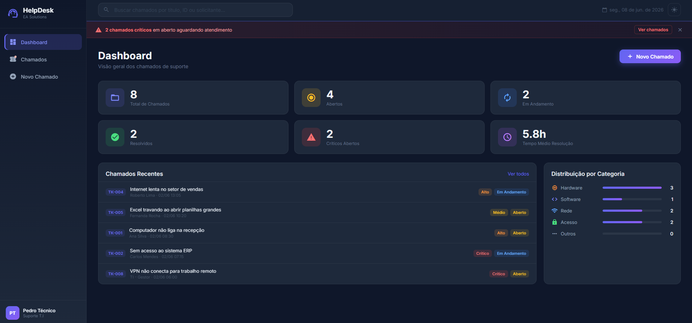
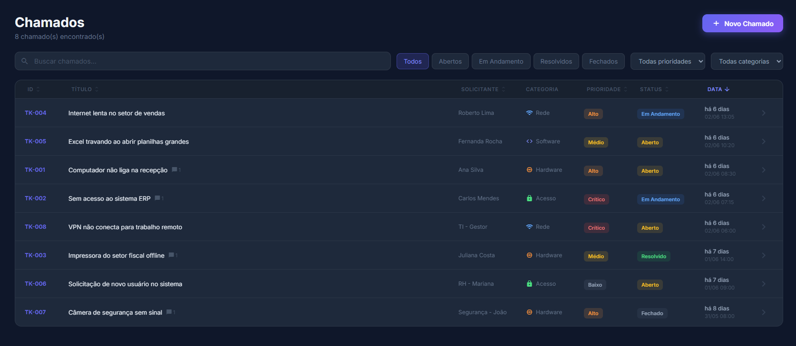
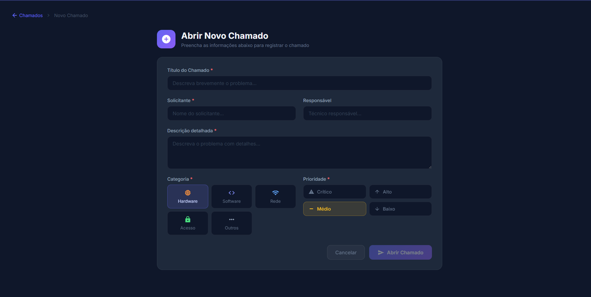

# HelpDesk EA

🔗 **[Acessar o projeto](https://pedroaruana.github.io/HelpDeskEA/)**


---

## Sobre o projeto

Trabalhei com suporte de T.I e sempre tive uma reclamação com os sistemas que a gente usa no dia a dia: são lentos ou cheios de coisa que ninguém usa. Quis construir algo do zero que fizesse sentido pra mim  — simples, rápido e com uma interface que não desse vergonha de mostrar.

O HelpDesk EA é um sistema completo para abertura e acompanhamento de chamados de suporte, com frontend em Angular e backend próprio em Node.js conectado a um banco PostgreSQL real. Os dados persistem entre sessões, tem autenticação com login e JWT, e o backend fica hospedado no Render.

Ele tem dashboard com métricas, lista de chamados com filtros, detalhe com linha do tempo e comentários, formulário de abertura, busca global e chat de suporte virtual. Tudo com tema escuro e claro e deploy automático via GitHub Actions.

Esse projeto também foi minha entrada no Angular e no desenvolvimento de APIs de verdade. Aprendi bastante na prática.

---

## Screenshots







---

## Funcionalidades

- **Autenticação JWT** — token gerenciado automaticamente, dados protegidos entre frontend e backend
- **Dashboard** — métricas de chamados em tempo real: abertos, em andamento, resolvidos e críticos
- **Lista de chamados** — tabela com busca por texto e filtros por status, prioridade e categoria
- **Ordenação por coluna** — clica no cabeçalho para ordenar a tabela
- **Detalhe do chamado** — visualização completa com linha do tempo, comentários e alteração de status
- **Novo chamado** — formulário de abertura com seleção de categoria e prioridade
- **Busca global** — campo no topo que encontra qualquer chamado pelo título, ID ou solicitante
- **Excluir chamado** — com confirmação para evitar acidentes
- **Notificação de críticos** — banner de alerta quando há chamados críticos em aberto
- **Tema claro/escuro** — toggle salvo automaticamente no navegador
- **Chat de suporte virtual** — assistente flutuante com respostas automáticas para dúvidas comuns
- **Contador de tempo** — mostra há quanto tempo cada chamado está aberto
- **Perfil do técnico** — estatísticas e chamados atribuídos

---

## Tecnologias

| Tecnologia | Por que usei |
|---|---|
| Angular 17+ | Framework principal — queria aprender de verdade, não só tutoriais |
| Angular Material | Componentes prontos com visual consistente |
| TypeScript | Tipagem forte, menos bug em produção |
| Angular Signals | Estado reativo sem RxJS desnecessário |
| Node.js + Express | Backend próprio com API REST completa |
| PostgreSQL (Neon) | Banco de dados real na nuvem, gratuito |
| JWT | Autenticação segura entre frontend e backend |
| Render | Hospedagem do backend, gratuita e estável |
| UptimeRobot | Monitoramento do backend, mantém o servidor sempre ativo |
| GitHub Actions | CI/CD automático: lint → build → deploy |
| GitHub Pages | Hospedagem do frontend, deploy sem complicação |

---

## Dificuldades

Algumas coisas que não foram fáceis:

**O deploy automático me deu trabalho.** Nunca tinha configurado isso antes e quebrou umas três vezes seguidas por motivos diferentes. Fui ajustando aos poucos até entender o que cada erro queria dizer. Quando funcionou pela primeira vez e vi o site no ar sozinho foi satisfatório.

**As rotas quebravam fora da página inicial.** Se eu acessava qualquer outra tela direto pela URL, dava página não encontrada. Demorei pra entender que não era bug do meu código, era o jeito que o serviço de hospedagem funciona. Resolvi com um arquivo extra que redireciona tudo corretamente.

**Entender o sistema de estado do Angular.** Li sobre isso antes de começar mas na prática foi diferente. Os filtros da lista de chamados não atualizavam do jeito certo, precisei refazer essa parte duas vezes até funcionar como eu queria.

**O tema claro/escuro deu mais trabalho do que parecia.** Achei que ia ser rápido mas todos os componentes tinham as cores escritas direto no código. Tive que ir arquivo por arquivo trocando por variáveis. Chato de fazer, mas o resultado valeu.

---

## Arquitetura

```
HelpDeskEA/
├── src/                        # Frontend Angular
│   └── app/
│       ├── models/             # Tipos e interfaces (Ticket, Comment...)
│       ├── services/           # TicketService, AuthService, ThemeService
│       ├── interceptors/       # Interceptor HTTP para JWT
│       ├── environments/       # URLs de dev e produção
│       └── components/
│           ├── sidebar/        # Menu lateral
│           ├── topbar/         # Barra superior com busca e toggle de tema
│           ├── dashboard/      # Tela principal com estatísticas
│           ├── ticket-list/    # Lista com filtros e ordenação
│           ├── ticket-detail/  # Detalhe e gerenciamento do chamado
│           ├── new-ticket/     # Formulário de abertura
│           ├── profile/        # Perfil do técnico
│           ├── chat-widget/    # Chat de suporte virtual flutuante
│           └── confirm-dialog/ # Modal de confirmação reutilizável
└── helpdesk-api/               # Backend Node.js
    ├── src/
│   ├── routes/             # tickets.js, auth.js
│   └── middleware/         # Verificação JWT
    ├── index.js            # Entrada da aplicação
    └── seed.js             # Dados iniciais
```

---

## CI/CD

A cada `push` na branch `main`:

1. Executa o lint do código
2. Faz o build de produção
3. Publica automaticamente no GitHub Pages

---

## Como rodar localmente

Precisa ter Node.js 18+ e Angular CLI instalados.

**Frontend:**
```bash
git clone https://github.com/Pedroaruana/HelpDeskEA.git
cd HelpDeskEA
npm install
npm start
```

**Backend:**
```bash
cd helpdesk-api
npm install
# crie um arquivo .env com base no .env.example
npm run dev
```

Frontend: **http://localhost:4200** | Backend: **http://localhost:3001**

---

## Autor

Feito por **Pedro Aruana** — técnico de suporte T.I

[](https://github.com/Pedroaruana)

---

## Licença

Distribuído sob a licença MIT. Veja o arquivo [LICENSE](LICENSE) para mais detalhes.
